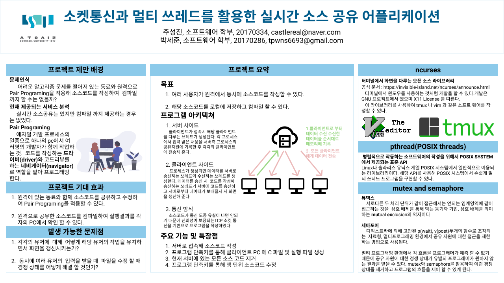

# SSU_Network_Programing_Source_Code_sharing

## 2021 숭실대학교 네트워크 프로그래밍 기말 프로젝트

소켓 통신과 멀티 쓰레드를 활용해서 실시간 소스 공유 프로그램을 만든 프로젝트 입니다.

## dependency 

    apt install libncurses5-dev libncursesw5-dev
컴파일시    `-lcurses` 를 gcc 옵션으로 주어야 합니다.

## 프로젝트 포스터

